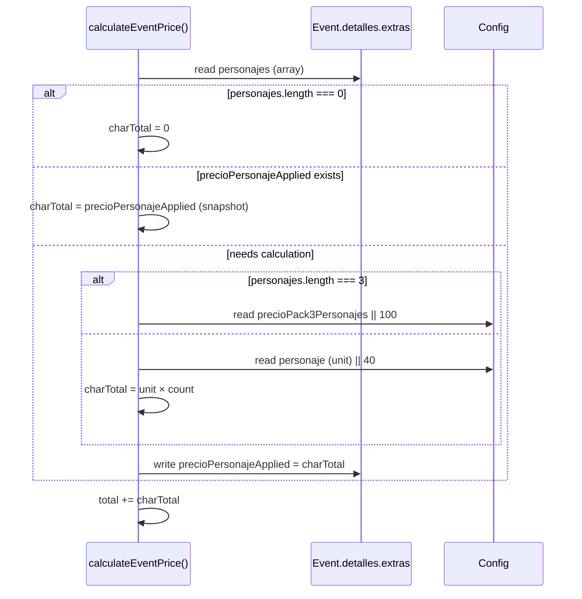
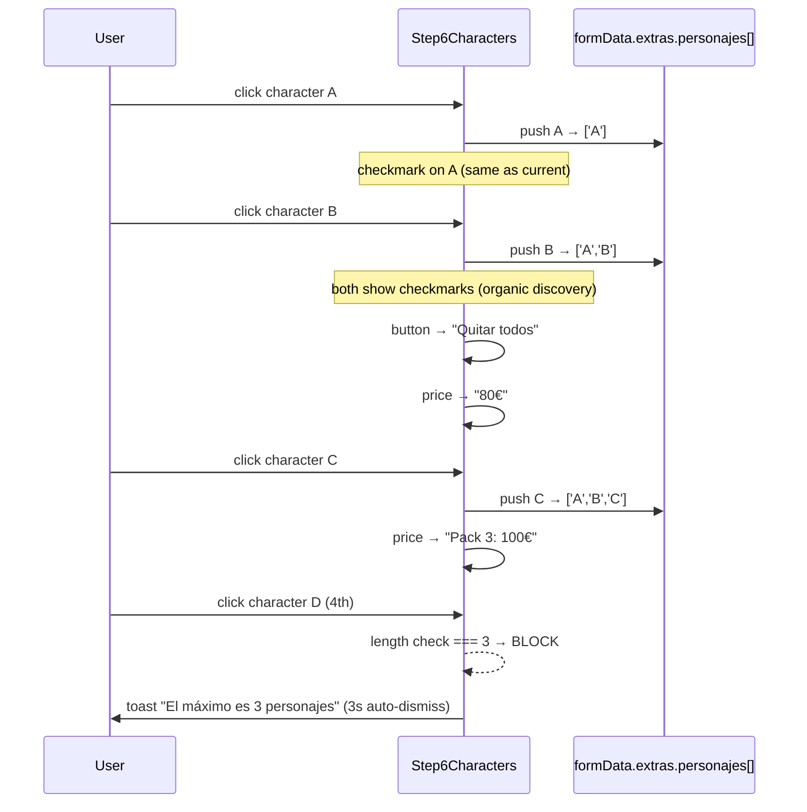

# Design: Multi-Personajes — Hasta 3 personajes por evento

## Technical Approach

Backend-first incremental: model → migration → pricing → services → frontend. The core pattern extends `fix-snapshot-pricing-update/` snapshot invalidation to arrays. `precioPersonajeApplied` becomes a **total-cost snapshot** (not per-unit). Silent multi-select UX implemented via toggle array in state, zero visual indicators. One-shot idempotent migration. Files: ~18 across backend and frontend.

## Architecture Decisions

| Decision | Choice | Alternative | Rationale |
|----------|--------|-------------|-----------|
| `personaje: String` → `personajes: [String]` | New field, drop old after migration | Keep both fields temporarily | Cleaner model; migration handles transition atomically |
| `precioPersonajeApplied` semantics | Total cost snapshot (e.g., 100€ for 3) | Per-unit snapshot (40€ each) | Aligns with existing snapshot pattern (single field stores applied cost); avoids array of snapshots |
| Snapshot invalidation | Sorted array stringify comparison | Deep equality of sets | Order-independent; prevents unnecessary invalidation when user reorders selection; simple to implement |
| Pack pricing: 3 chars = 100€ | `precioPack3Personajes` from Config | Hardcoded 100€ | Admin-configurable; follows existing `preciosExtras` pattern |
| UX discovery | Silent multi-select (toggle, no indicators) | Badge counter "2/3" | Client-validated: organic discovery preferred over visual clutter |
| Migration idempotency | Check for `personajes` field existence | Migration version tracking | Simpler; self-healing on re-run |

## Sequence Diagrams

### Pricing Calculation Flow



### Character Selection UX Flow (Step6Characters)



### Snapshot Invalidation Flow (Event Update)

```mermaid
sequenceDiagram
    participant CT as events.update()
    participant O as oldDetalles.extras
    participant N as newDetalles.extras
    participant E as event document

    CT->>O: get old personajes
    CT->>N: get new personajes
    CT->>CT: sortedCompare(old, new)
    alt arrays differ (by content)
        CT->>E: event.set('detalles.extras.precioPersonajeApplied', undefined)
        Note over CT: snapshot deleted; recalculated on save
    else arrays identical (or same chars, different order)
        Note over CT: NO invalidation — snapshot preserved
    end
```

## File Changes

| # | File | Action | What Changes |
|---|------|--------|-------------|
| 1 | `api/models/event.model.js` | Modify | `personaje: String` → `personajes: [String]` with `validate: arr.length <= 3` |
| 2 | `api/models/config.model.js` | Modify | Add `precioPack3Personajes: { type: Number, default: 100 }` inside `preciosExtras` |
| 3 | `api/scripts/migrate-personaje-to-array.js` | **Create** | Idempotent one-shot: String→Array, recalculate prices, update Config |
| 4 | `api/controllers/events.controllers.js` | Modify | `calculateEventPrice()`: array pricing (1=40, 2=80, 3=pack). `update()`: sorted snapshot invalidation. `validateEventData()`: max 3. |
| 5 | `api/services/google.service.js` | Modify | `detalles.extras.personaje` → `(personajes||[]).join(', ')` |
| 6 | `api/config/mailer.config.js` | Modify | Same join pattern for confirmation email |
| 7 | `web/src/pages/BookingPage.jsx` | Modify | `extras.personaje: null` → `extras.personajes: []` |
| 8 | `web/src/pages/BudgetPage.jsx` | Modify | Same state initialization change |
| 9 | `web/src/utils/bookingUtils.js` | Modify | Array-based pricing: 1=40, 2=80, 3=pack |
| 10 | `web/src/components/booking/Step6Characters.jsx` | Modify | **Highest complexity**. `selectCharacter()` → toggle array logic; 4th-block toast; dynamic price display; "Quitar todos"/"Sin Visita" switch; modal button shows "Añadir"/"Quitar" |
| 11 | `web/src/components/booking/Step8Summary.jsx` | Modify | Render character list (1=name+image, 2-3=stacked+pack label) |
| 12 | `web/src/components/booking/StepBudgetSummary.jsx` | Modify | Same as Step8Summary |
| 13 | `web/src/components/admin/ReservationDetailView.jsx` | Modify | Read view: avatar chips for each character. ExtrasEdit: multi-toggle picker with removable chips, stays open |
| 14 | `web/src/components/admin/ConfigurationPanel.jsx` | Modify | Add `precioPack3Personajes` input field |
| 15 | `web/src/pages/PricingPage.jsx` | Modify | Show "Pack 3: 100€" below unit price |
| 16 | `api/tests/budget-flow.test.js` | Modify | 0/1/2/3 character scenarios with price assertions |
| 17 | `web/src/utils/bookingUtils.test.js` | Modify | Mirror backend pricing tests |
| 18 | `web/src/components/booking/Step8Summary.test.jsx` | Modify | Update mocks: `personaje` → `personajes` |

## Migration Strategy

1. **Pre-migration**: Dump production DB
2. **Script** (`api/scripts/migrate-personaje-to-array.js`): Iterates events. Skips if `personajes` exists. Converts: `'Elsa'`→`['Elsa']`, `'ninguno'`/null/empty→`[]`. Adds `precioPack3Personajes: 100` to Config if absent. Recalculates `precioPersonajeApplied`
3. **Post-migration**: Audit random sample of events for price integrity
4. **Rollback**: Revert commit + run reverse script (`['Elsa']`→`'Elsa'`, `[]`→`'ninguno'`)

## Testing Strategy

| Layer | What | How |
|-------|------|-----|
| Unit (api) | `calculateEventPrice` for 0/1/2/3 chars | Jest + mongodb-memory-server, budget-flow |
| Unit (api) | Snapshot invalidation on update | Same test file, verify `precioPersonajeApplied` reset |
| Unit (web) | `calculateBookingTotal` mirror | Vitest, bookingUtils.test.js |
| Component (web) | Step8Summary renders multi-char | Testing Library + jsdom |
| Manual | Safari iOS: Step6Characters toggle, toast, price | Physical device + BrowserStack |

## Open Questions

None — all design decisions resolved with client validation.
